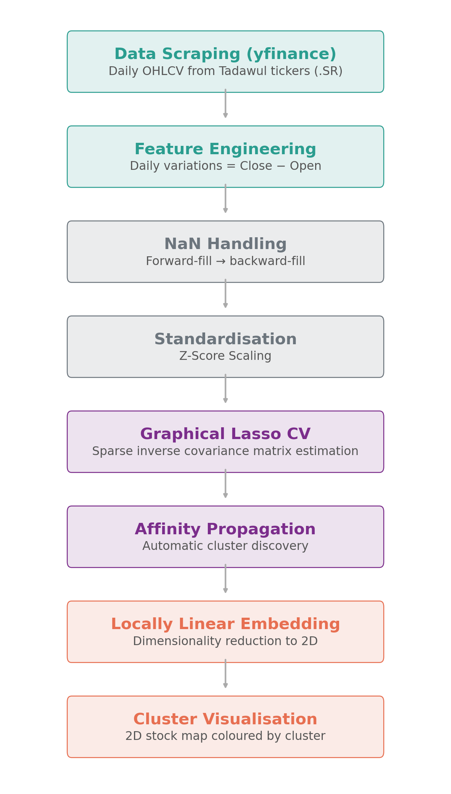
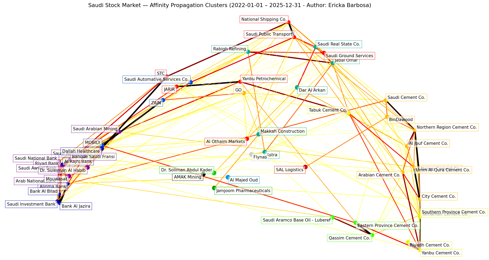

# Saudi Stock Market Clustering - Tadawul (2022-2025)
> Unsupervised ML applied to the Saudi Exchange (Tadawul) to uncover hidden correlation structures among 54 stocks across 8 sectors. 
>
 ## Executive Summary
 In this algorithm both Graphical Lasso CV and Affinity Propagation methodology were applied to cluster the present Saudi Stocks.The features are their daily variations from a time-series dataset throughout three years, covering data from 54 stocks across 8 sectors: Energy, Banking, Telecommunications, Retail, Real State, Healthcare, Cement and Transportation.
 The main goal of this project is to identify clusters of stocks that move together in the Tadawul, not based on their sectors, but rather purely based on their price behaviour, and to use the results from this research for a smarter diversification analysis and portfolio optimisation. The results are presented in a graphical form in order to facilitate the understanding through data visualisation.

## Why not Markowitz Mean-Variance Portfolio Theory?
 Markowitz Mean-variance Portfolio Theory is the classical approach to portfolio construction. However, according to Seregina & Lee (2023), when the number of stocks (p) in the dataset is larger than the number of observations (n), obtaining portfolio weights leads to unstable investment allocations, known as the Markowitz' curse.
 Alternatively, Graphical Lasso is a powerful tool to estimate a high-dimensional inverse covariance matrix in order to provide consistent and stable estimations fo asset allocations, based on Friedman et al (2008) and Seregina & Lee (2023). Graphical Lasso solves the Markowitz' curse by estimating the sparse inverse covariance matrix directly, penalizing weak correlations. Goto & Xu (2015) also obtained positive results aand avhieved significant out-of-sample risk reduction and higher returns after applying Graphical Lasso.

## Methodology 
> The present algorithm consists mainly of seven steps. Subsequently, these steps are described:

<p align="center">
  
</p>

## 1. Data Scraping:
   The financial data was extracted using the Python yfinance library, the data was scraped in a dictionary form containg the ticker as keys and the name of the stock as values. The raw data fetched consisted of OHLCV (Open High Low Close Volume) values indexed by its date in the format datetime64[ns]. After the raw data scraping, it was then handled and appended into 4 separated lists containing the useful values for the model: symbols, names, close prices and open prices. The lists containing the close and open prices where then manipulated and stacked in order to proceed for the featuring engineering step.
   
## 2. Feature Engineering: 
The features used in the model are the daily price variations of the 54 stocks. In order to obtain these values, the difference between the close price and the open price is defined as variations for each trading day:
>variation = close_prices - open_prices

This measure was used to capture the intraday directional movements of each stock. Positive values indicates that the stock gained value during that session, while negative values indicate a loss. Thereafter, these variation values were stored in a pandas DataFrame and transposed in order to be cleaned and handled.

## 3. Data Cleaning: 
In order to produce a complete matrix of shape n_stocks x n_days without NaN values, the missing observations from non-trading days were handled through forward-fill followed by a backward-fill interpolation.

## 3. Standardisation:
The z-score scaling was applied to the dataset used in the Graphical Lasso model to prevent the model from being influenced by raw value inflation caused by differing means, and to ensure equal weighting across stocks for the regularisation penalty.

## 4. Graphical Lasso CV:
After cleaning and applying z-score scaling to the dataset, it was then fitted into the Graphical Lasso CV method to estimate the sparse precision matrix (inverse covariance matrix) for Gaussian Graphical models, with a cross-validated choice of the L1 penalty from a logarithmically spaced range of candidate values (alphas). The Python library scikit-learn was used to implement this method.

## 5. Affinity propagation:
The final exploratory data analysis was performed using the Afinitty Propagation clustering algorithm, which automatically identifies clusters and their exemplars (representative points) without requiring the number of clusters to be specified in advance.

## 6. Locally Linear Embedding:
Locally Linear Embedding (LLE) was applied to the data to reduce it to a 2D space while preserving its essential structure. LLE dimensionality reduction was used to facilitate cluster visualisation in a 2D map coloured by cluster, by producing coordinates for each stock as a node.

## 7. Cluster Visualisation:
A 2D stock map containing coloured stock nodes and their connections in a network form was produced to facilitate visualisation in a simple and intuitive way. The partial correlations used to form the network were derived from the precision matrix to determine the strength of pairwise relationships between stocks, with absolute partial correlations greater than 0.02 being retained. The node coordinates from LLE and the relationships from partial correlations were then plotted using the matplotlib library. The node size is scaled according to the inverse-variance weighting of each stock. The node colour is assigned according to cluster membership. Edge thickness and colour intensity are scaled according to the strength of the partial correlations, allowing both cluster structure and the relative strength of pairwise relationships to be interpreted visually.

## Stock Universe
 Total : 54 stocks across 8 sectors
| Sector | No. of Stocks | Names |
|---|---|---|
| Energy | 6 | Saudi Aramco, Ma'aden, Rabigh, Yanbu, Luberef, AMAK |
| Banking | 10 | Al Rajhi, SNB, Riyad Bank, Alinma Bank, Saudi Awwal Bank, Banque Saudi Fransi, Arab National Bank, Bank Al Bilad, Saudi Investment Bank, Bank Al Jazira |
| Telecom | 4 | STC, Mobily, Zain, GO |
| Retail | 5 | Jarir, BinDawood, Al Othaim, SASCO, Al Majed Oud |
| Real Estate | 4 | Dar Al Arkan, Jabal Omar, Saudi Real State Co., Makkah Construction |
| Healthcare | 6 | Dr. Sulaiman Al Habib, Mouwasat, Jamjoom, Astra, Dallah Healthcare, Dr. Soliman Abdul Kader |
| Cement | 14 | Saudi Cement, Yamamah, Qassim, Southern Province, Riyadh, Yanbu, Arabian, Eastern Province, City, Northern Region, Najran, Umm Al-Qura, Tabuk, Al Jouf |
| Transportation | 5 | National Shipping, SAL, Flynas, Saudi Ground Services, SPT |

## Results
>Each colour represents a cluster discovered by Affinity Propagation. Proximity in the 2D embedding reflectws similarity in daily price variation pattern.



Key findings:

**Banking stocks formed tight clusters. The Cluster 2 contains the five major banks of Saudi Arabia alongside with other large-cap stocks, which possibily indicates high liquidity and common risk factor, with no sector specific dynamics alone (cross-sector cluster).**

**Cement companies clustered independently from energy, splitting into 3 separate clusters Cluster 9, 10 and 11) which may indicate regional dominance differences or production/demand exposure.**

**Cross-sector clusters apperaed between certain transportation and retail companies, poininting to shared consumer spending exposure.**

**Real State is the only sector which is grouped in just one specific cluster (Cluster 6). This cluster also contains Rabigh Refining and Astra, which is less intuitive.**

**Clusters 1, 5, 7, 8, 13 and 14 contain only one specific stock. These clusters are represented by AMAK mining, Al Majed Oud, Jamjoom Pharmaceuticals, Dr Soliman Abdul Kader, SAL Logistics and Flynas.This indicates that these stocks price behvaiour may not strongly correlate with any other stock in the sample. This can be possibly occur as a result of low-trading volume or unique business models.**

## How to Run
 
**1. Clone the repository**
```bash
git clone https://github.com/YOUR_USERNAME/saudi-stock-clustering.git
cd saudi-stock-clustering
```
 
**2. Install dependencies**
```bash
pip install -r requirements.txt
```
 
**3. Run the script**
```bash
python saudi_stock_cluster.py
```
 
The chart will be saved to `outputs/saudi_stock_clusters.png`.

## Author
 
Built as part of a private financial modelling research project on the Saudi Exchange (Tadawul).  
Feel free to open an issue or reach out if you have questions or suggestions.
